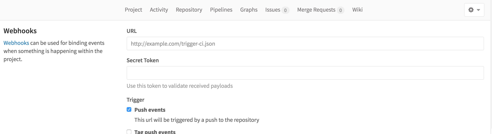

\# GitLab Web Hook For PHP


### 开始使用

​  服务器环境必须先安装git环境，Webhook脚本依赖PHP运行环境，同时需要有exec函数执行权限。使用前需要先开启禁用的PHP部分可执行函数，参考以下设置

```shell
$ which php
/usr/local/php/bin/php

$ sudo vi /usr/local/php/etc/php.ini

#在disable_functions前面添加#
;disable_functions = passthru,exec,system,chroot,chgrp,chown,shell_exec,proc_open,proc_get_status,ini_alter,ini_restore,dl,openlog,syslog,readlink,symlink,popepassthru,stream_socket_server,fsocket,popen

```

1. #### 在实际项目目录克隆远程仓库

   Gitlab Webhook自动部署也需要在指定的git仓库中运行，也即是在实际项目目录中需要远程克隆git仓库，例如：

   ```shell
   $ git clone git@gitlabserver:developer/project.git
   $ cd project
   $ pwd
   /mnt/www/project
   ```

2. #### 在项目目录克隆`Gitlab Web Hook For PHP`

   进入项目目录，克隆[gitlab web hook for php](https://github.com/bravist/gitlab-webhook-php)。克隆完成后，需要将项目中带有{server} {project}字样的内容替换为自己的服务器IP与服务器目录

   ```shell
   $ git clone https://github.com/bravist/gitlab-webhook-php
   $ cd gitlab-webhook-php
   $ pwd 
   /mnt/www/project/gitlab-webhook-php
   $ ll
   total 20
   -rwxrwxrwx 1 www www  140 Sep 13 09:59 develop_deploy.sh
   -rwxrwxrwx 1 www www 1812 Sep 13 09:59 gitlab.php
   -rwxrwxrwx 1 www www  138 Sep 13 09:59 master_deploy.sh
   -rwxrwxrwx 1 www www   88 Sep 13 09:59 README.md
   -rwxrwxrwx 1 www www  673 Sep 13 11:09 webhook.log

   ```

3. #### 配置Gitlab项目Webhooks

   进入你的gitlab控制台 =》选择项目 =》 设置 =》 Webhooks设置，新加Webhooks

   

   ​

   类似的URL与Secret Token：

   ```http
   http://server/gitlab-webhook-php/gitlab.php?token=MmNmMGRmMGI2Y2EyYjY3NzFjMzRjODkzZTQ3NjY5M2Y=

   MmNmMGRmMGI2Y2EyYjY3NzFjMzRjODkzZTQ3NjY5M2Y=
   ```

4. #### 测试服务器是否通信成功

   ```shell
   $ tail webhook.log
   BRANCH: refs/heads/master
   =======================================================================
   Request on [2016-09-13 10:28:01] from [118.178.58.22]
   ```

   如果有类似的日志，表示webhook通信成功，如果项目中的文件无任何修改就一定是权限的问题

5. #### 权限配置

   最开始配置成功后，非常多的人会遇到这个问题：Webhook通信成功，但是仓库源码却没有更新？在Linux环境中，我们需要先确认Nginx与php-fpm的默认执行用户

   ```shell
   $ sudo ps aux | grep php
   www      22131  0.0  0.2  42872 23096 ?        S    02:13   0:03 nginx: worker process
   www      22132  0.0  0.2  42900 23352 ?        S    02:13   0:01 nginx: worker process

   $sudo ps aux | grep php-fpm
   www      22347  0.0  0.1 163832  9008 ?        S    02:13   0:00 php-fpm: pool www
   ```

   确认是www用户在运行，也即是说gitlab中的Webhooks的所有请求都是以www用户在执行。再次查看我们的hook for php脚本

   ```php
   $ cat gitlab.php
   ...
   exec("/mnt/www/project/public/gitlab-webhook-php/master_deploy.sh");
   ...
   ```

   http://server/gitlab-webhook-php/gitlab.php?... 此请求默认以www 用户去访问gitlab.php，然后执行`master_deploy.sh`脚本。因此，需要给www用户设置 Public Key Authentication

   ```shell
   $ sudo mkdir /home/www
   $ sudo -u www ssh-keygen -t rsa
   ...
   $ cat /home/www/.ssh/id_rsa.pub
   ```

   将此公钥加入gitlab中的SSH KEYS中

6. 设置项目的文件夹用户与用户组为`www`

   ```shell
   $ sudo chown -R www:www /mnt/www/project
   ```


如果在配置过程中有问题，可以@我的微博：`会勇同学`或者邮箱：chenghuiyong1987@gmail.com